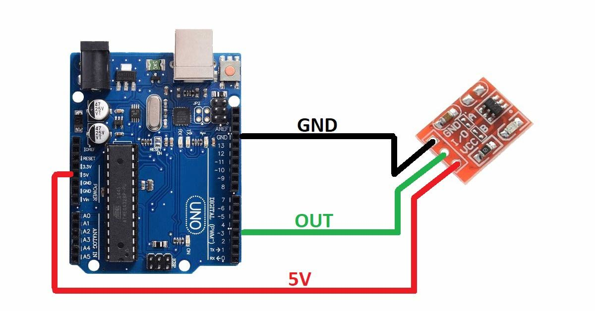

# Arduino Touch Sensor LED Control  

This project shows how to use a **Touch Sensor with Arduino** to directly control an **LED ON/OFF**.  
When the sensor is touched, the LED turns **ON**, and when released, it turns **OFF**.  
The status is also displayed in the **Serial Monitor**.  

---

## 🔧 Components Required
- Arduino Uno (or compatible board)  
- Touch Sensor Module (TTP223 or similar)  
- LED 
- Jumper Wires  

---

## ⚡ Circuit Diagram
  

---

## 🎥 Demo Video
Watch the working demo on my YouTube channel:  
👉 [Ecempire7](https://www.youtube.com/@Ecempire7)  

---

## 🚀 Steps to Run
1. Connect the circuit as shown in the diagram.  
2. Upload the Arduino code from this repository.  
3. Open the Serial Monitor at 9600 baud.  
4. Touch the sensor → LED turns **ON**.  
5. Release the sensor → LED turns **OFF**.  
filename here)*  
